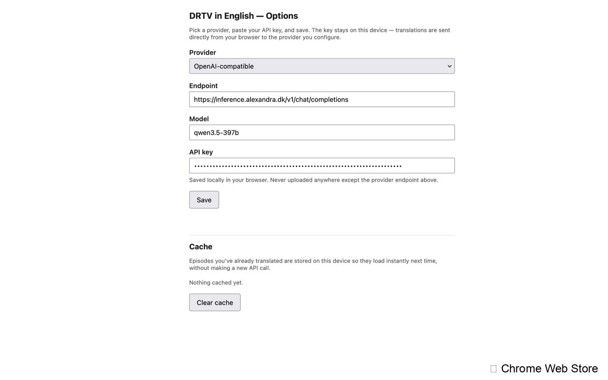
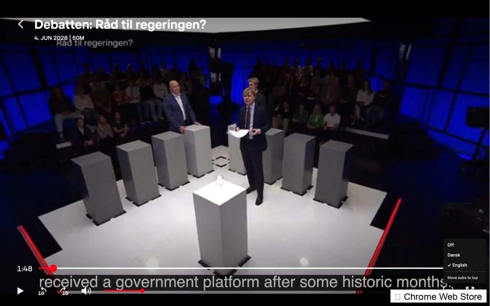
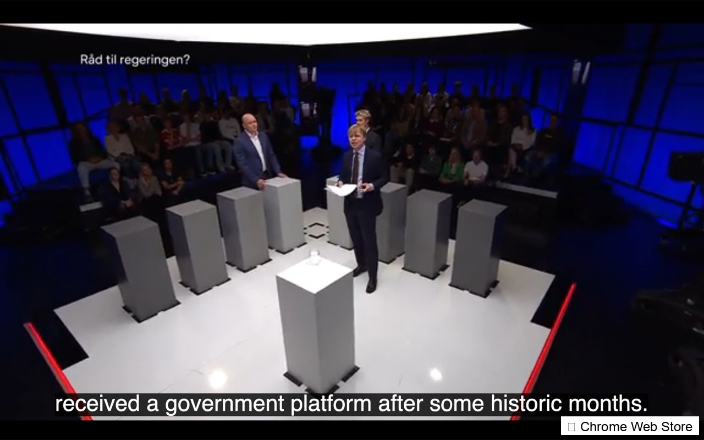

<!-- markdownlint-disable MD041 -->
# DRTV in English

Watch DR TV with English subtitles via a Manifest V3 browser extension
(Chrome + Firefox) that injects translated cues into DR's own player.
Bring your own LLM API key — nothing runs on a server.

______________________________________________________________________
[](https://github.com/saattrupdan/danglish/blob/main/LICENSE)
[](https://github.com/saattrupdan/danglish/commits/main)

Developer:

- Dan Saattrup Smart (<dan.smart@alexandra.dk>)

## How it works

1. Detects when you open an episode on `dr.dk/drtv`.
2. Sniffs DR's Danish `.vtt` subtitle file from the network.
3. Translates the cues with your chosen LLM provider.
4. Injects the English cues as a native `TextTrack` on DR's `<video>`.

No backend, no proxy, no media downloading. DR's player handles
playback; the extension only adds an extra subtitle track.

Full architecture and phased plan: [`docs/extension-plan.md`](docs/extension-plan.md).

## Layout

```
manifest.chrome.json
manifest.firefox.json
build.mjs                 # esbuild → dist/chrome and dist/firefox
src/
  background/             # service worker: vtt-sniffer + vtt-parser + translator
  content/                # menu + track injector
  options/                # provider/key form
  shared/                 # types, episode-id helpers, storage wrapper
spike/                    # Phase 0 single-file spike (kept for reference)
icons/
docs/
  extension-plan.md
```

## Screenshots


*Options page — choose your LLM provider and enter your API key*


*Three-way Off / Dansk / English menu injected into DR's player*


*English subtitles rendering over the video*

## Develop

```sh
npm install
npm run build      # one-shot: produces dist/chrome and dist/firefox
npm run watch      # rebuild on save
npm run package    # build, then zip each target into dist/ for store upload
npm run typecheck  # tsc --noEmit
```

`npm run package` produces `dist/drtv-in-english-chrome-<version>.zip` and
`dist/drtv-in-english-firefox-<version>.zip`. Sourcemaps are excluded.
The Chrome zip is what the Web Store accepts directly; AMO accepts the
Firefox zip and re-signs it as an XPI on submission.

### Load in Firefox

1. `about:debugging#/runtime/this-firefox` → **Load Temporary Add-on**.
2. Pick `dist/firefox/manifest.json`.
3. Open a DRTV episode (e.g. the Phase 0 test episode in
   [`docs/extension-plan.md`](docs/extension-plan.md)).
4. Click DR's subtitle button → pick **English** to translate the
   episode. The status pill in the bottom-right shows progress.
5. DevTools → Browser Console to see `[drtv-en/...]` logs from both
   the content script and the background script.

> If the first English click reports *"No Danish VTT seen yet"*, pick
> **Dansk** first. That makes DR's player fetch the subtitle file, the
> background sniffer captures it, and then English works on the next
> click.

### Load in Chrome

1. `chrome://extensions` → toggle **Developer mode**.
2. **Load unpacked** → `dist/chrome`.
3. Same verification flow as Firefox.

## What's shipped

- Background service worker:
  - `webRequest` sniffer for `*.vtt` on `*.dr.dk` (`vtt-sniffer.ts`).
  - VTT parser with CRLF → LF normalisation (`vtt-parser.ts`).
  - Real LLM adapters for Anthropic, OpenAI, Gemini, and
    OpenAI-compatible endpoints, plus a stub for offline testing.
  - Per-tab port lifecycle with cancel-on-disconnect.
  - IndexedDB cache keyed by `(episodeId, sourceVttHash)`.
- Content script:
  - Three-way Off / Dansk / English menu hooked into DR's existing
    subtitle button (sibling "EN" pill as fallback).
  - Single English `TextTrack` per `<video>`, cleared on cancel.
  - Status pill showing `Translating subtitles to English… N%`.
  - SPA navigation handling between episodes within DRTV.
- Options page: provider, endpoint, model, API key persisted to
  `chrome.storage.local`. Cache-size readout and clear-cache button.

## What's deferred

- Overlay subtitle renderer (Phase 0 confirmed native `TextTrack`
  works; we keep the spec but don't ship the renderer until a DR
  build masks the native track).

## Store status

- **Firefox Add-ons (AMO)** — Submitted, awaiting approval
- **Chrome Web Store** — Submitted, awaiting review

Once approved, installation links will be available on both stores.
The build script produces store-ready zips via `npm run package`.

## Contribute

See [`CONTRIBUTING.md`](./CONTRIBUTING.md) and the
[code of conduct](./CODE_OF_CONDUCT.md).
